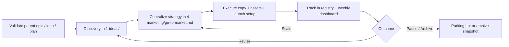

# Marketing Workflow - AI-First Startup Factory

## Purpose

This workflow governs how marketing work moves from hypothesis to strategy, execution, and measurement without fragmenting the source of truth.

Use it after mode selection in [primary-workflow.md](primary-workflow.md). Keep `4-marketing/go-to-market.md` as the canonical strategy document, and only break work out when a separate brief or asset is genuinely necessary.

## Mode Routing

- `chat` - Scope, questions, and prioritization only. No file edits.
- `ideas` - Market/customer discovery, early GTM hypotheses, and validation.
- `plan` - Centralize approved strategy, personas, and campaign structure.
- `execution` - Produce copy, assets, launch setup, and campaign operations.
- `review` - Analyze results, record learnings, and clean up active campaign state.

## Canonical Files

| Stage | Canonical File | Purpose |
|------|----------------|---------|
| Early GTM thinking | `1-ideas/marketing/initial-go-to-market-plan.md` | Initial market entry ideas and early channel hypotheses |
| Research support | `1-ideas/market-research/summaries.md` | Source-backed research feeding positioning and channels |
| Personas | `4-marketing/personas.md` | Audience definition and message targeting |
| Strategy | `4-marketing/go-to-market.md` | Canonical GTM strategy and active campaign index |
| Campaign tracking | `4-marketing/performance/registry.md` | Active marketing work items and links |
| Weekly metrics | `4-marketing/performance/weekly-dashboard.md` | CAC, CPA, LTV, ROAS, top messages, next actions |
| Creative outputs | `shared/assets/` | Visual assets, creative exports, campaign collateral |
| Major strategy history | `4-marketing/history/gtm-changelog.md` | Significant GTM pivots and strategic updates |

## Agent Ownership

| Agent | Responsibility | Main Outputs |
|------|----------------|--------------|
| `@product-strategist` | Validate parent epic/idea/plan and success metrics before work proceeds | `2-product-foundation/`, backlog linkage |
| `@market-research` | Customer, competitor, category, and demand research | `1-ideas/market-research/` |
| `@marketing-expert` | GTM strategy, campaign prioritization, message system, performance loop | `4-marketing/` |
| `@creative-director` | Brand direction, narrative consistency, creative briefs | `4-marketing/`, `shared/assets/` |
| `@graphics-designer` | Final campaign visuals and production assets | `shared/assets/` |
| `@business-analyst` | CAC/LTV guardrails, spend assumptions, business case support | `1-ideas/`, `5-financing/` |
| `@docs-guardian` | Placement, naming, link hygiene, anti-sprawl enforcement | cross-domain |

## Phase 0: Validation & Routing

1. Confirm the task belongs to an existing epic, idea, or plan before execution starts.
2. Decide the correct maturity level:
   - Idea-stage or exploratory work stays in `1-ideas/`.
   - Approved/live marketing work belongs in `4-marketing/`.
3. Read current state before editing:
   - `4-marketing/go-to-market.md`
   - `4-marketing/personas.md`
   - `4-marketing/performance/registry.md`
   - `4-marketing/performance/weekly-dashboard.md`
4. Activate relevant skills based on task shape:
   - `research` for audience, competitor, and channel validation
   - `planning` for GTM structure, prioritization, and campaign design
   - `ai-multimodal` for creative evaluation or asset requests
   - `media-processing` for asset optimization
5. Update existing campaign or strategy sections first. Do not create parallel marketing docs unless coordination needs justify them.

## Phase 1: Discovery & Hypothesis (`ideas`)

**Primary owner:** `@market-research` with `@marketing-expert`

**Tasks:**
1. Validate target segment, pain points, buying triggers, and proof points.
2. Test channel hypotheses using real evidence, not channel wishlists.
3. Update `1-ideas/marketing/initial-go-to-market-plan.md` if the work is still exploratory.
4. Update `1-ideas/market-research/summaries.md` when new research materially changes messaging, segmentation, or channel choice.
5. Define measurable leading indicators:
   - target audience reach
   - signup or lead target
   - conversion target
   - CAC/LTV guardrails where applicable

**Quality gate:**
- Every major market claim has a source or is explicitly marked as an assumption.
- Audience and message hypotheses are specific enough to test.
- The work names a parent epic, parent idea, or approved plan.

## Phase 2: Strategy Centralization (`plan`)

**Primary owner:** `@marketing-expert`

**Tasks:**
1. Update `4-marketing/go-to-market.md` as the single source of truth for:
   - positioning
   - core messaging
   - primary and secondary channels
   - campaign priorities
   - success metrics
2. Update `4-marketing/personas.md` when segmentation or persona logic changes.
3. Add or update campaign rows in `4-marketing/performance/registry.md` with:
   - `MKT-TASK-XXX`
   - parent epic or explicit marketing-only rationale
   - owner
   - status
   - key links
4. Keep campaign detail inside `go-to-market.md` by default.
5. Use `4-marketing/templates/campaign-brief-template.md` only when a standalone brief adds coordination value across multiple stakeholders, experiments, or asset sets.
6. If a standalone brief is needed, confirm placement with `@docs-guardian` first and link it from both GTM and the marketing registry.
7. Only include launch timelines or schedules when the user explicitly asks for them.

**Quality gate:**
- Messaging maps to persona pain points and proof.
- Channel choice is prioritized, not a long undifferentiated list.
- Each active campaign has an owner, target metric, and measurement path.
- No non-existent folders or placeholder storage patterns are introduced.

## Phase 3: Campaign Execution (`execution`)

**Primary owner:** `@marketing-expert` with `@creative-director` and `@graphics-designer` as needed

**Tasks:**
1. Produce copy, offers, and CTA variants in the GTM doc or approved brief.
2. Store or link visual assets in `shared/assets/`.
3. Confirm measurement before launch:
   - UTMs or equivalent tracking
   - destination page or conversion path
   - baseline creative/message variants
   - stop/scale criteria
4. Update `4-marketing/performance/registry.md` when a campaign status changes.
5. Update `4-marketing/performance/weekly-dashboard.md` once a campaign is live and generating data.

**Minimum launch readiness:**
- Tracking exists before spend or promotion starts.
- Message, audience, and CTA variants are defined.
- Budget and unit-economics assumptions are not disconnected from reality.
- Creative assets live in `shared/assets/`, not ad hoc folders.

## Phase 4: Measurement, Review, and Governance (`review`)

**Primary owner:** `@marketing-expert` with `@docs-guardian`

**Tasks:**
1. Record weekly metrics in `4-marketing/performance/weekly-dashboard.md`.
2. Update `4-marketing/performance/registry.md` with status, links, and outcome signals.
3. Move paused or stale campaigns to the Parking Lot section in `4-marketing/go-to-market.md`.
4. Log major GTM pivots in `4-marketing/history/gtm-changelog.md`.
5. Mirror materially active cross-domain marketing work in `3-technical/3.2-implementation/status/work-items-registry.md` when other domains depend on it.
6. Update `8-governance/changelog.md` when the repository workflow, structure, or canonical marketing process changes.

**Quality gate:**
- Results are compared against the original target, not described vaguely.
- Learnings produce a next action: scale, revise, pause, or archive.
- Active campaign count remains manageable; stale work does not stay in active lists indefinitely.

## File Placement Rules

- Do not create `4-marketing/channels/` or parallel campaign folder trees by default.
- Do not create standalone reports when the weekly dashboard, registry, or GTM section is sufficient.
- Keep active campaign state in `4-marketing/`; keep creative outputs in `shared/assets/`.
- Keep `go-to-market.md` to 10 or fewer active campaigns; move the rest to Parking Lot or archive snapshots.
- Every live campaign entry must have an ID, owner, status, and measurement path.

## Flow



## Handoff Template

Use the orchestration handoff block from [orchestration-protocol.md](orchestration-protocol.md) exactly:

```markdown
### ORCHESTRATION HANDOFF

**Current mode**: ideas | plan | execution | review
**Task completed**: Yes / No / Partial
**Files created/modified**:
- 4-marketing/go-to-market.md
- 4-marketing/personas.md
- 4-marketing/performance/registry.md
- 4-marketing/performance/weekly-dashboard.md
- shared/assets/[campaign-slug]/[asset-name]

**Next recommended agent**: @marketing-expert / @creative-director / @graphics-designer / @business-analyst / @docs-guardian / @human
**Next task**: "Specific next marketing action"
**Priority**: High / Medium / Low
```

If skills were important to the work, list them on the line immediately after the block, for example: `Skills activated: research, planning`.
