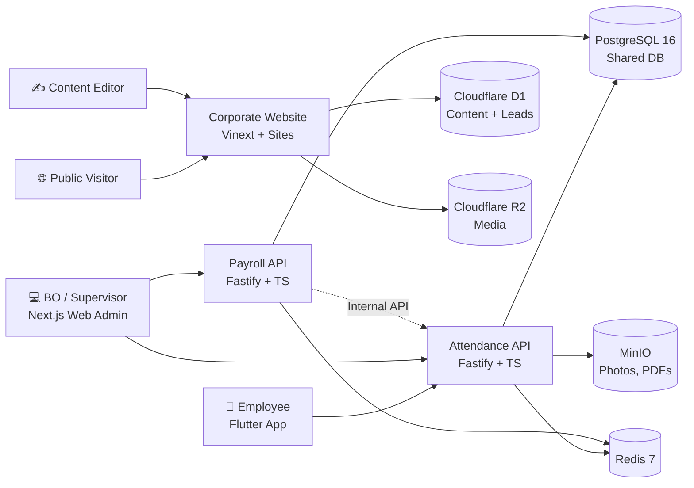

# System Overview — AKAIUNSAN

**Status:** Active
**Last Updated:** 2026-08-05
**Owner:** @system-architecture
**Related:** PRD-EPIC-002, PRD-EPIC-003

## Purpose

This document provides a high-level overview of all systems in AKAIUNSAN, their relationships, and how they work together. It maps to the actual `systems/` directory.

## Systems Architecture

### System Diagram



### Systems List

#### `attendance` (PRD-EPIC-002)

- **Purpose:** Mobile employee check-in/out (GPS + photo), project management, real-time attendance view for supervisors, customer-facing reports (PDF/CSV by project).
- **Location:** [`systems/attendance/`](../../../systems/attendance/README.md)
- **Tech Stack:** Flutter 3.24 (mobile), Node.js 20 + Fastify + TypeScript (backend), PostgreSQL 16, Redis 7, MinIO (photos)
- **Domain Context:** Attendance bounded context + Identity shared kernel
- **Related:** See [Domain Specs](domain-specs.md#2-attendance-bounded-context)

#### `payroll` (PRD-EPIC-002)

- **Purpose:** Web admin only — calculate monthly payroll, allow BO to override lines (advance, deductions), approve and lock periods, export Excel for accounting.
- **Location:** [`systems/payroll/`](../../../systems/payroll/README.md)
- **Tech Stack:** Node.js 20 + Fastify + TypeScript (backend), Next.js 14 (web admin), PostgreSQL 16, Redis 7, ExcelJS (export)
- **Domain Context:** Payroll bounded context + Identity shared kernel
- **Reads attendance data via:** `GET /internal/attendance` endpoint on attendance API (X-Internal-API-Key auth)

#### `corporate-website` (PRD-EPIC-003)

- **Purpose:** Public company website, service/solution knowledge pages, apartment booking, project survey leads, and editorial Content Studio.
- **Location:** [`systems/corporate-website/`](../../../systems/corporate-website/README.md)
- **Tech Stack:** Vinext/React, Cloudflare-compatible D1/R2 bindings, Docker, Cloudflare Tunnel, password-protected review Admin.
- **Domain Context:** Corporate Content + Lead Intake.
- **Deployment:** Dedicated Docker Compose project published at `akaiunsan.prismate.vn` through its own Cloudflare Tunnel.

## Cross-Cutting

| Concern | Owner | Location |
| --- | --- | --- |
| Shared DB schema (users, projects, tenants) | Identity shared kernel | `systems/shared/db/prisma/schema.prisma` |
| Auth (JWT issuance, refresh tokens) | Identity | `systems/shared/auth/` |
| Common error types, logging | Cross-cutting | `systems/shared/` |
| Deployment (Docker Compose stack) | @devops | `systems/attendance/docker-compose.yml` (single stack hosts both systems) |
| Public brand and content policy | @marketing | `4-marketing/brand-guidelines.md` |
| Corporate content, leads, media | Corporate Website | D1 + R2 through `systems/corporate-website/` |

## Deployment Topology

```
On-Premise Server (Ubuntu 22.04, 16GB RAM)
├── Caddy (reverse proxy + TLS)
├── Docker Compose
│   ├── attendance-api (Fastify)
│   ├── payroll-api (Fastify)
│   ├── web-admin (Next.js — for both systems)
│   ├── postgres (shared)
│   ├── redis (shared)
│   └── minio (photos only)
└── Backup: daily pg_dump + MinIO sync to VPS
```

External access via Cloudflare Tunnel → Caddy → backend containers.

The public corporate website is deployed independently through a dedicated Docker Compose project and Cloudflare Tunnel. It does not expose or directly connect to the attendance/payroll database.

See [Infrastructure](../infrastructure.md) for full hosting details.

## Future Systems

- `recruitment` (potential epic after PRD-EPIC-002) — pipeline cho lao động phổ thông
- `inventory` — quản lý vật tư/hóa chất per project
- `quality-inspection` — supervisor photo evidence for service quality
