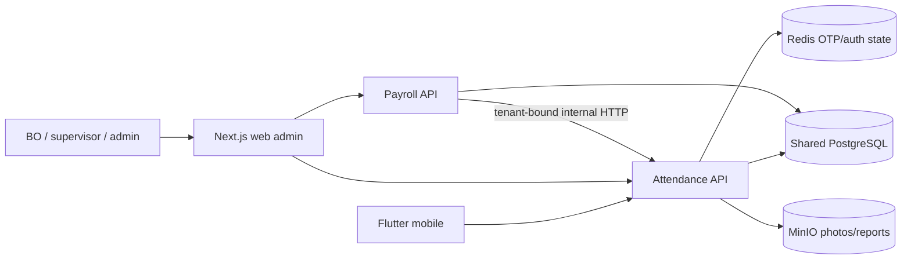

# System Overview — AKAIUNSAN

**Status:** Reconciled with the 2026-08-09 local delivery candidate

**Last Updated:** 2026-08-09

**Owner:** @system-architecture

**Related:** PRD-EPIC-002

## Systems

### Attendance

- **Location:** [systems/attendance](../../../systems/attendance/README.md)
- **Purpose:** Employee authentication, project/shift operations, GPS/photo
  check-in/out, audited attendance override, explicit supervisor membership, and
  PDF/CSV customer reports.
- **Runtime:** Fastify/TypeScript API plus Flutter Android/iOS scaffolds.
- **Data services:** PostgreSQL, Redis OTP/challenge state, and private MinIO.

### Payroll

- **Location:** [systems/payroll](../../../systems/payroll/README.md)
- **Purpose:** Monthly period calculation, rule versions, audited line overrides,
  approval, paid/locked states, and XLSX export through the shared web admin.
- **Runtime:** Fastify/TypeScript API plus Next.js 15 web admin.
- **Attendance input:** `GET /internal/attendance` on Attendance with
  `X-Internal-API-Key` and required tenant/employee/date scope.

## Shared Kernel and Repository Mapping

| Concern | Canonical implementation |
| --- | --- |
| Prisma schema and migrations | `systems/shared/src/db/prisma/` |
| Auth, OTP/TOTP, JWT, refresh, RBAC | `systems/shared/src/auth/` |
| Money/errors/storage/health helpers | `systems/shared/src/` |
| Compose and Caddy | `systems/shared/docker-compose.yml`, `systems/shared/Caddyfile` |
| Web admin for both APIs | `systems/payroll/web-admin/` |
| Cross-system contract | [OpenAPI](api-contracts/openapi.yaml) |

PostgreSQL is physically shared, but Payroll does not query Attendance records
directly during calculation; the tenant-bound internal HTTP projection is the
implemented boundary. Payroll still reads shared Identity/employee and payroll
tables through Prisma.

## Deployment Boundary

The repository ships a single-host Compose topology: Attendance `:3000`, Payroll
`:3001`, web admin `:3002`, PostgreSQL, Redis, MinIO, and Caddy. Cloudflare Tunnel
terminates public TLS and reaches Caddy on local HTTP. The main hostname serves
web plus the mobile `/api/attendance/v1/*` prefix; a separate storage hostname
routes presigned MinIO requests.

Local candidate validation is complete, including fresh migrations, 9/9 live
Playwright scenarios against the final container stack, production package and
image builds, non-root production-only application closures, API readiness
checks, and a web-container `/login` smoke test. Commit `056a769` and its five green
remote jobs remain historical baseline evidence only; the 2026-08-09 candidate
still requires an exact-SHA review and a new green remote CI run before merge.
The live server, tunnel policy, log rotation, backup schedule/restore drill, iOS
release signing and physical-device validation, and pilot/scale-out are not yet
accepted.

## Future Systems

Recruitment, inventory, quality inspection, asynchronous workers, offline mobile
sync, and high-availability infrastructure require separately approved work.

## Related Documents

- [Infrastructure](../infrastructure.md)
- [System Design](../design-standards/system-design.md)
- [Domain Specs](domain-specs.md)
- [On-Premise Runbook](../../3.3-devops/server-steps.md)
