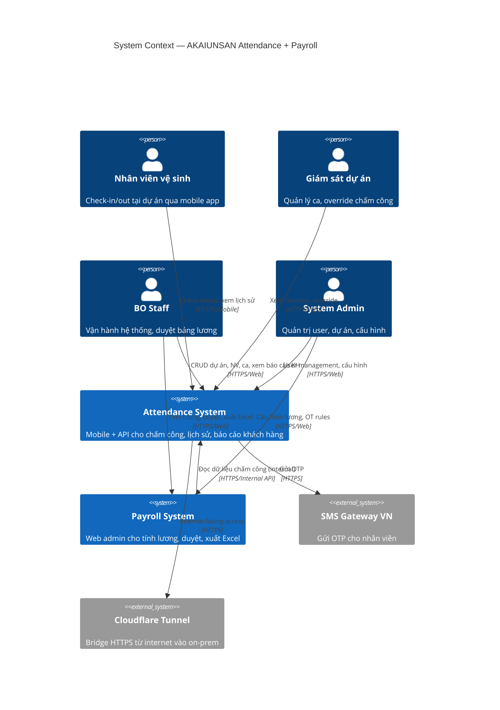
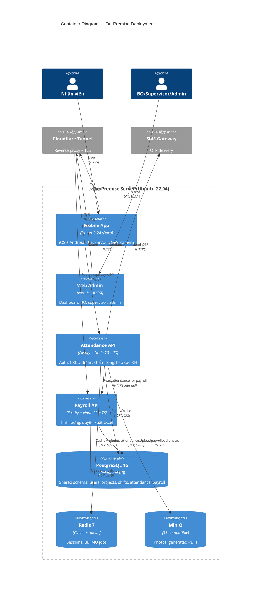
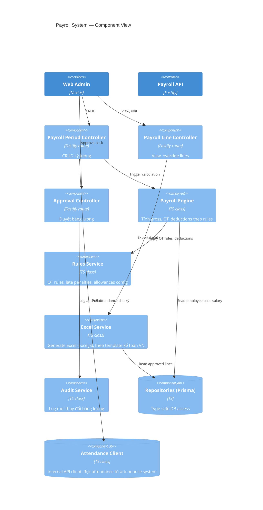
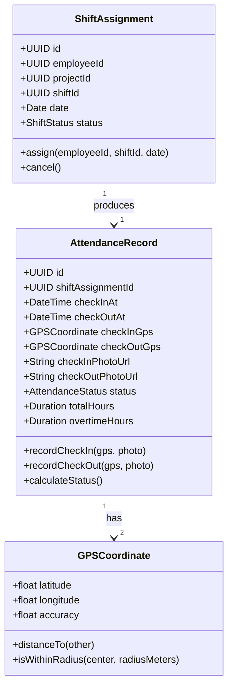
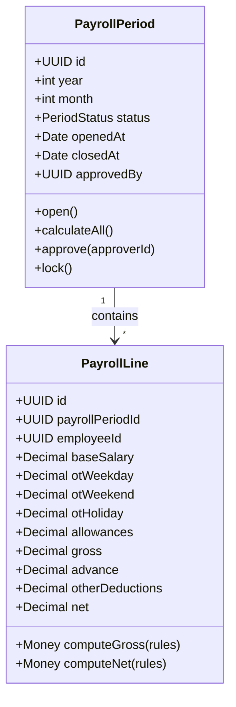
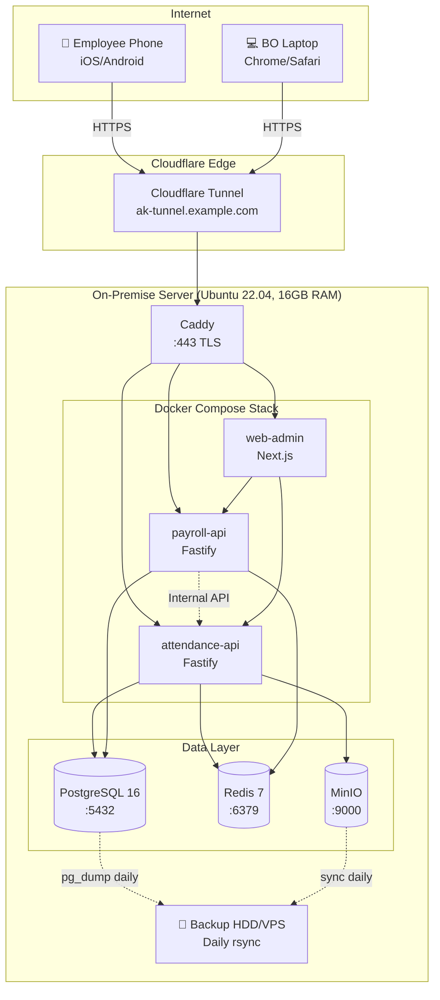

# System Design — AKAIUNSAN Attendance + Payroll

**Status:** Active — Phase 0 deliverable for PRD-EPIC-002
**Last Updated:** 2026-07-16
**Owner:** @system-architecture
**Related:** [Infrastructure](../infrastructure.md), [Domain Specs](../architecture/domain-specs.md)

## Overview

This document describes the C4 model diagrams (Context, Container, Component, Code) for the **attendance** and **payroll** systems. Per factory convention, system-specific concerns live in `systems/[name]/docs/architecture.md`; this document captures the cross-cutting design shared by both systems.

## C4 Level 1: System Context



**Actors:**
- **Nhân viên vệ sinh:** ~200 người, 15 dự án, dùng mobile app Flutter
- **Giám sát dự án:** ~15 người (1/dự án), dùng web admin
- **BO Staff:** ~3-5 người, dùng web admin cho cả 2 hệ thống
- **System Admin:** 1-2 người, full access

## C4 Level 2: Container Diagram



**Key decisions:**
- **Two API containers (not monolith):** Allows independent deployment, clearer bounded contexts, payroll can be scaled separately if needed
- **Shared Postgres:** Simplifies data consistency (no cross-service sync); schemas separated per service
- **MinIO for photos:** Self-hosted S3 alternative; presigned URLs for secure access
- **Cloudflare Tunnel:** Eliminates need for static IP / port forwarding on office router

## C4 Level 3: Component Diagrams

### Attendance System Components

```mermaid
C4Component
    title Attendance System — Component View

    Container(mobile_app, "Mobile App", "Flutter")
    Container(web_admin, "Web Admin", "Next.js")
    Container(attendance_api, "Attendance API", "Fastify")

    Component(auth_ctrl, "Auth Controller", "Fastify route", "Login, OTP, refresh tokens")
    Component(project_ctrl, "Project Controller", "Fastify route", "CRUD dự án, GPS bounds")
    Component(employee_ctrl, "Employee Controller", "Fastify route", "CRUD nhân viên, gán dự án")
    Component(shift_ctrl, "Shift Controller", "Fastify route", "CRUD ca, schedule")
    Component(attendance_ctrl, "Attendance Controller", "Fastify route", "Check-in/out, queries")
    Component(report_ctrl, "Report Controller", "Fastify route", "Customer report generator")

    Component(schedule_svc, "Schedule Service", "TS class", "Auto-assign shifts, detect conflicts")
    Component(attendance_svc, "Attendance Service", "TS class", "GPS validation, late detection, status calculation")
    Component(photo_svc, "Photo Service", "TS class", "Upload, presigned URLs, MinIO interaction")
    Component(report_svc, "Report Service", "TS class", "PDF generation (PDFKit), CSV export")
    Component(notif_svc, "Notification Service", "TS class", "OTP via SMS gateway")

    ComponentDb(repo, "Repositories (Prisma)", "TS", "Type-safe DB access")

    Rel(mobile_app, auth_ctrl, "Login, refresh")
    Rel(web_admin, auth_ctrl, "Login, refresh")
    Rel(mobile_app, attendance_ctrl, "Check-in/out")
    Rel(web_admin, project_ctrl, "Manage projects")
    Rel(web_admin, employee_ctrl, "Manage employees")
    Rel(web_admin, shift_ctrl, "Manage shifts/schedules")
    Rel(web_admin, attendance_ctrl, "View, override")
    Rel(web_admin, report_ctrl, "Generate, export")

    Rel(auth_ctrl, notif_svc, "Send OTP")
    Rel(attendance_ctrl, attendance_svc, "Validate GPS + process")
    Rel(attendance_ctrl, photo_svc, "Upload photos")
    Rel(shift_ctrl, schedule_svc, "Auto-assign")
    Rel(report_ctrl, report_svc, "Generate PDF/CSV")
    Rel(attendance_svc, repo, "Read/write")
    Rel(schedule_svc, repo, "Read/write")
    Rel(photo_svc, minio, "S3 API")
    Rel(report_svc, repo, "Read attendance data")
    Rel(notif_svc, sms, "HTTPS")
```

### Payroll System Components



**Cross-system data flow:** Payroll API does NOT directly access attendance tables. It calls Attendance API's internal endpoints (`/api/internal/attendance?from=...&to=...&employee_id=...`) for cleaner separation. Internal API key in header for auth.

## C4 Level 4: Code (Selected Examples)

For MVP, we won't diagram every class. Below are key domain model classes that capture business logic. See [Domain Specs](../architecture/domain-specs.md) for full DDD model.

### Attendance Aggregate



### Payroll Aggregate



## Deployment Diagram



## Key Architectural Patterns

1. **Bounded Contexts (DDD):** Two systems = two bounded contexts: Attendance and Payroll. Identity shared.
2. **Shared Kernel:** Postgres database shared; `users`, `employees`, `projects`, `tenants` tables are part of Shared Kernel, owned by Identity context but readable by both.
3. **Internal API Communication:** Payroll reads attendance data via internal HTTP API (not direct DB query), preserving service autonomy.
4. **Event-Driven Asynchrony:** Domain events (e.g., `AttendanceRecorded`) published to Redis pub/sub; payroll can subscribe if needed (Phase 2+).
5. **CQRS-lite:** Read-heavy queries (BO dashboard) use optimized read paths; write paths go through domain services. Not full CQRS — overkill for MVP scale.
6. **Repository Pattern:** All DB access via Prisma repositories in `db/repositories/`; controllers never touch Prisma directly.

## Security Boundaries

| Boundary | Controls |
| --- | --- |
| Internet ↔ On-prem | Cloudflare Tunnel (TLS, DDoS) |
| Mobile app ↔ API | JWT + refresh token, rate limit |
| Web admin ↔ API | Same as mobile; admin endpoints require role check |
| Attendance API ↔ Payroll API | Internal API key in header, IP allowlist (both on same Docker network) |
| Backend ↔ Postgres | Username/password, private Docker network only |
| Backend ↔ MinIO | Access/secret key, presigned URLs for client uploads/downloads |

## Related Documents

- [Infrastructure](../infrastructure.md) — Server specs, hosting model
- [Domain Specs](../architecture/domain-specs.md) — DDD aggregates, business rules
- [API Contracts](../architecture/api-contracts/) — OpenAPI 3.1 specs
- [Coding Standards](coding-standards.md) — TS/Flutter conventions
- [Attendance System Architecture](../../../../systems/attendance/docs/architecture.md) — System-specific details
- [Payroll System Architecture](../../../../systems/payroll/docs/architecture.md) — System-specific details
