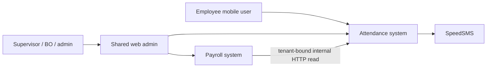
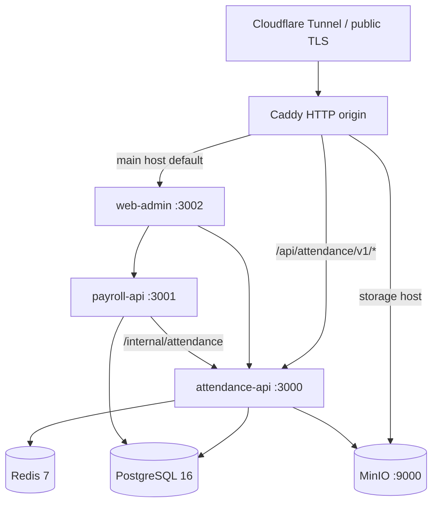

# System Design — AKAIUNSAN Attendance + Payroll

**Status:** Reconciled with the 2026-07-21 implementation tree

**Last Updated:** 2026-07-21

**Owner:** @system-architecture + @fullstack-engineer

**Related:** [Infrastructure](../infrastructure.md), [Domain Specs](../architecture/domain-specs.md)

## Context

Attendance owns employee authentication, projects, explicit supervisor scope,
shifts, check-in/out, photos, and customer reports. Payroll owns periods, rules,
calculation, approval, overrides, and XLSX export. Both run as separate APIs over
one physical PostgreSQL schema; Identity is a shared kernel.

The shipped mobile flow covers login, today's assignment, GPS/photo check-in/out,
and refresh rotation. Mobile history, offline retry, and push notifications remain
future work. The web admin is an internal operations surface, not a customer portal.

## Container View

- Caddy preserves one main hostname for web and mobile; it strips only the
  public `/api/attendance` prefix before forwarding mobile `/v1/*` requests.
- Next.js server-side rewrites reach both APIs by Compose service name.
- Payroll calculation is synchronous and transactional. Redis is not a job queue.
- The internal projection is registered at `/internal/attendance`, requires the
  shared internal key and explicit tenant/employee/date inputs, and is not routed
  by the public Caddy configuration.

## Implemented Component Map

### Attendance

| Area | Implemented boundary |
| --- | --- |
| HTTP routes | `src/routes/{auth,attendance,employees,projects,shifts,reports,rbac,internal}.ts` |
| Authorization | shared permission middleware plus `project-access.ts` tenant/membership predicates |
| Attendance logic | `attendance-service.ts`, `schedule-service.ts`, `geo-service.ts` |
| Media/reporting | `photo-service.ts` and `services/reports/customer-report.ts` |
| Persistence | Prisma queries in routes/services; there is no separate repository directory in this MVP |
| Mobile | Flutter `core`, `features/auth`, and `features/attendance` with Riverpod/Dio/secure storage |

### Payroll

| Area | Implemented boundary |
| --- | --- |
| HTTP routes | `src/routes/payroll.ts` with permission and tenant checks |
| Orchestration | `payroll-service.ts` serializes and commits period calculation atomically |
| Pure engine | `engine/{calculator,holidays,working-days,vietnam-tax}.ts`; compliance modes are disabled for MVP outcomes |
| Attendance input | `clients/attendance-client.ts` calls the tenant-bound Attendance internal endpoint |
| Export | `excel-exporter.ts` returns XLSX binary |
| Persistence | Prisma queries in routes/services; no BullMQ worker or repository abstraction is shipped |

The conceptual aggregates in the domain specs guide invariants; they are not a
claim that every aggregate is implemented as a class with the same methods.

## Critical Data Flows

### Employee check-in/out

1. A static native Prismate launch mark (legacy Android launch background, Android 12+ system splash, and iOS launch storyboard) bridges into the Flutter `/splash` route on a consistent white background. The reusable Flutter mark animates only while real work is pending, becomes static under reduced motion, and introduces no artificial delay. The route reads secure storage once and resolves synchronous router state without flashing Login/Today; network loss alone never clears a stored session.
2. Mobile sends assignment ID, GPS evidence, and bounded JPEG data captured by the official camera-only UI.
3. Attendance verifies employee/assignment/project scope, Haversine distance, full JPEG decode, 5 MB/16 MP ceilings, and a minimum 320×240 raster. Device attestation/liveness remains outside MVP, so direct-API camera origin is not claimed.
4. A conditional transaction creates/updates one coherent attendance record.
5. The private MinIO key is persisted; authorized reads receive a short-lived URL.

If the employee cancels capture, the app stays in the normal retry path. Confirmed
permission denial, unavailable hardware, or camera/plugin failure keeps employee
submission disabled and promotes the supervisor-assisted recovery plus a Today
re-check action. An authorized supervisor (or system-admin break-glass) can record
a scoped manual event without synthetic GPS/photo; the event is bounded to the
assignment business date/support window, record/assignment state and
`override_attendance` audit commit atomically. BO and employee surfaces classify
it as a camera-assisted exception only when actor and structured camera-failure
reason provenance are both present.

### Payroll calculation

1. An authorized actor claims an open/calculated period by compare-and-set.
2. Payroll loads active same-tenant employees and rules.
3. For each employee, Payroll calls Attendance with `tenantId`, `employeeId`, and
   the inclusive Vietnam date range using `X-Internal-API-Key`.
4. Decimal-safe calculation preserves explicit allowance overrides.
5. Lines, totals, state, and calculation audit are committed atomically.

### Admin authentication

1. Password verification and active-account checks create an opaque TOTP challenge.
2. The challenge is stored/attempt-limited in Redis and delivered by an HTTP-only cookie.
3. Successful TOTP verification issues access and rotating refresh credentials.
4. Refresh replay revokes the complete token family.

For temporary local/test verification, an explicitly configured four-digit
`DEV_FIXED_ADMIN_2FA_CODE` replaces the TOTP verifier only. The API still
requires password and active-admin checks, the opaque Redis challenge, its TTL
and attempt budget, and normal credential issuance/rotation. The flag fails
configuration startup unless `NODE_ENV` is explicitly `development` or `test`;
it must be absent from shared development, staging, production, Compose, and CI.
While enabled, the API binds to loopback and rejects fixed-mode admin auth whose
effective client address is outside the loopback range. The web-admin development
server also binds to loopback, closing its same-origin rewrite as a LAN path into
the fixed verifier.

## Shipped Patterns and Deferred Patterns

| Shipped | Deferred / not claimed |
| --- | --- |
| Separate Attendance and Payroll APIs | Redis pub/sub domain events |
| Shared PostgreSQL Identity kernel | BullMQ/asynchronous payroll jobs |
| Internal HTTP attendance projection | Dedicated repository layer |
| Permission + tenant + project-membership authorization | Full CQRS/event sourcing |
| Transactional/conditional state transitions | Multi-host HA/Kubernetes |

## Security Boundaries

| Boundary | Current controls |
| --- | --- |
| Internet → origin | Cloudflare public TLS and tunnel; Caddy origin routing |
| Mobile/web → APIs | JWT, refresh rotation, production global rate limit, auth-specific abuse controls |
| Supervisor → project data | Explicit active `ProjectSupervisor` membership plus tenant predicates |
| Payroll → Attendance | Private Compose network, shared internal key, required tenant/employee/date scope |
| APIs → PostgreSQL/Redis/MinIO | Service credentials and private/local bindings |

No source-IP allowlist is implemented inside the Attendance internal route. The
Compose network and key are current controls; network policy hardening is an
operator deployment responsibility.

## Validation Boundary

The implementation is validated locally and by the green exact-SHA and
post-merge CI runs recorded in the active plan. Unit/coverage suites,
real-service integration, live web E2E, production package/image builds,
configuration checks, and Android analysis/tests/APK pass. iOS release signing
and physical-device validation, load/SLO testing, production tunnel,
backup/restore, and pilot acceptance remain open gates.

## Related Documents

- [Infrastructure](../infrastructure.md)
- [Domain Specs](../architecture/domain-specs.md)
- [OpenAPI Contract](../architecture/api-contracts/openapi.yaml)
- [Coding Standards](coding-standards.md)
- [Attendance Architecture](../../../systems/attendance/docs/architecture.md)
- [Payroll Architecture](../../../systems/payroll/docs/architecture.md)
