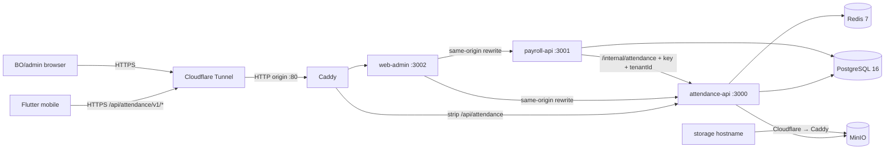

# Infrastructure — AKAIUNSAN Attendance + Payroll

**Status:** Implemented repository topology; production operations and pilot evidence pending

**Last Updated:** 2026-08-09

**Owner:** @system-architecture + @devops

**Related ADRs:** [ADR-001: Tech Stack](../../8-governance/decision-log/adr-001-tech-stack.md), [ADR-002: On-Premise Hosting](../../8-governance/decision-log/adr-002-on-premise.md)

## Scope

This document describes what the repository ships for the single-host
Attendance/Payroll deployment and separates it from operator-owned production
targets. The stack has been built and configuration-validated locally; no live
server, backup schedule, restore drill, load test, or pilot has been accepted yet.

## Shipped Stack

| Component | Image/runtime | Host binding / role |
| --- | --- | --- |
| Attendance API | Node 20, Fastify, TypeScript | `127.0.0.1:3000`; auth, attendance, projects, reports, internal attendance projection |
| Payroll API | Node 20, Fastify, TypeScript | `127.0.0.1:3001`; synchronous transactional payroll and XLSX export |
| Web admin | Next.js 15 | `127.0.0.1:3002`; same-origin rewrites to both APIs |
| PostgreSQL | PostgreSQL 16 | `127.0.0.1:5432`; shared physical schema and durable refresh-token records |
| Redis | Redis 7 | `127.0.0.1:6379`; OTP/TOTP challenge state, abuse controls, and readiness checks—not payroll jobs |
| MinIO | pinned MinIO release | `127.0.0.1:9000/9001`; private photos and generated reports |
| Caddy | Caddy 2 | origin reverse proxy; public TLS terminates at Cloudflare Tunnel |
| Mobile | Flutter 3.24.5 | Android debug APK validated; iOS release signing and physical-device validation pending |

There is no BullMQ worker, Redis event bus, Prometheus/Grafana stack, centralized
log collector, automatic retention worker, or offline mobile queue in the MVP.

## Network Topology

Only the main application hostname and separate storage hostname are public.
Payroll is reached by web-admin rewrites. The internal attendance endpoint stays
on the private Compose network and requires `X-Internal-API-Key` plus `tenantId`,
`employeeId`, and a bounded date range.

## Host Baseline (Recommendation, Not Validation)

| Resource | Starting recommendation |
| --- | --- |
| OS | Ubuntu 22.04 LTS |
| CPU / RAM | 4 vCPU / 16 GB |
| Storage | 500 GB NVMe plus a separate backup target |
| Power | UPS sized for a controlled shutdown |
| Network | Stable outbound HTTPS; no inbound application ports required with the tunnel |

Capacity figures are planning assumptions. The repository has not been load-tested
for 200 concurrent users or measured against a P95 latency/availability SLO.

## Windows Local / Controlled-UAT Profile

Windows 10/11 with Docker Desktop, WSL2, and Linux containers is a supported
local or controlled-UAT host only. It does not replace the Ubuntu 22.04
production/pilot baseline accepted in ADR-002.

The Windows profile merges `docker-compose.windows.yml` after the base Compose
file. The override replaces Linux `/data` binds with stable Docker named volumes
and binds Caddy, APIs, PostgreSQL, Redis, MinIO, and web admin to `127.0.0.1`.
The guarded PowerShell script deploys only an exact reviewed SHA from canonical
GitHub `main`, applies committed migrations, and then runs either the mandatory
RBAC seed or an explicitly selected UAT demo seed.

Seed-only Windows state may be owner-approved for `ResetSeedUat`; Git transports
the seed scripts, not database files. This exception does not apply to production
or pilot data. Public tunnel/firewall configuration, backup scheduling, host
monitoring, capacity acceptance, and production Windows operations remain outside
this profile.

## Persistence and Backup

Compose mounts production data at `/data/postgres`, `/data/redis`, `/data/minio`,
and `/data/caddy`. The repository includes a sample `pg_dump`/MinIO backup procedure
and restore-drill instructions in the runbook, but does not install cron, configure
WAL archiving, create off-site replication, or prove retention automatically.

Before pilot, the operator must:

1. Create and protect the backup destination.
2. Install the backup schedule and choose/enforce retention.
3. Encrypt and copy backups to the approved off-host target; same-host copies
   alone do not satisfy disaster recovery.
4. Run and record a restore drill.
5. Verify the documented RTO 4h / RPO 24h assumptions against that drill.

## Security Controls Shipped

| Concern | Current control |
| --- | --- |
| External TLS | Cloudflare edge TLS; tunnel reaches Caddy over the local origin path |
| Authentication | Argon2id passwords; employee SMS OTP; mandatory admin TOTP; JWT access; rotating hashed refresh-token families |
| Authorization | Permission lookup, tenant predicates, and explicit audited `ProjectSupervisor` membership |
| Secrets | Environment-only values; production runbook requires independent JWT/internal/TOTP secrets and mode-600 `.env` |
| Rate limiting | Production Fastify instances enforce a global 100 requests/minute limit; auth adds atomic OTP/challenge controls |
| Photos/reports | Private MinIO buckets and short-lived presigned URLs; report keys include tenant/project/report scope |
| Audit | Implemented for attendance overrides, supervisor membership, payroll calculate/approve/override/export, and payroll-rule changes; not every CRUD/state transition or report generation currently emits `AuditLog` |
| Network | Data services and APIs bind locally; internal API uses a shared key and tenant-bound query |

Production also requires `SMS_MODE=speedsms`; startup rejects mock and unimplemented
providers. Seed/demo credentials are forbidden on production and live pilot data.

## Observability and Operations

- Implemented: structured application stdout logs, `/health/live`, and dependency
  readiness at `/health/ready`.
- Operator-required before pilot: Docker log rotation/collection, a host-local
  readiness monitor, alert routing, disk/backup monitoring, secret rotation, and
  restore evidence.
- Future only: a protected external readiness route/monitor, Prometheus/Grafana,
  centralized log search, WAL/PITR, automated object lifecycle, and multi-host
  high availability.

## Validation Boundary

Local candidate evidence covers seven fresh migrations, real
PostgreSQL/Redis/MinIO integration, Attendance 13/13 plus Payroll 1/1 integration
tests, 9/9 live Playwright scenarios, package and production image builds,
production-only non-root closures for all three long-running images, real
in-image Prisma/native-module checks, an isolated seven-migration target, both
API readiness endpoints, web `/login`, image-based Playwright 9/9,
Compose/Caddy configuration, and Android build. Commit `056a769` and
[GitHub Actions run 29670131275](https://github.com/hungtrandigital/AKAIOS/actions/runs/29670131275)
are historical baseline evidence; they do not validate the 2026-08-09 candidate.
Reviewed candidate `90a95b0` passed all nine jobs in [Actions run 31295175661](https://github.com/hungtrandigital/AKAIOS/actions/runs/31295175661),
merged through [PR #1](https://github.com/hungtrandigital/AKAIOS/pull/1) as
`4f72810`, and passed the nine-job post-merge [Actions run 31295350615](https://github.com/hungtrandigital/AKAIOS/actions/runs/31295350615).
No deployment occurred. iOS release signing and physical-device validation,
production DNS/tunnel policy, backup/restore, capacity, and pilot behavior
remain release gates.

## Related Documents

- [System Design](design-standards/system-design.md)
- [System Overview](architecture/system-overview.md)
- [Domain Specs](architecture/domain-specs.md)
- [OpenAPI Contract](architecture/api-contracts/openapi.yaml)
- [Coding Standards](design-standards/coding-standards.md)
- [On-Premise Runbook](../3.3-devops/server-steps.md)
- [Windows Docker Local/UAT Runbook](../3.3-devops/windows-docker-deployment.md)
